  

<!-- ===================== ABOUT ===================== -->
<table width="100%" align="center">
<tr>
<td width="68%" valign="top">

<pre>
┌─[ root@mohid ]─[ ~/about ]──────────────────────────────────────────────────────────────────────────┐
│ $ cat about.txt                                                                                     │
│                                                                                                     │
│ &gt; operating at the intersection of low-level systems                                                │
│ &gt; and high-level web architecture. whether it's                                                     │
│ &gt; hardening a network, optimizing a SQL schema, or                                                  │
│ &gt; writing multithreaded C C++ code, I thrive on                                                     │
│ &gt; understanding how things work under the hood.                                                     │
│                                                                                                     │
| [pentesting] SonarQube, BurpSuite, Nuclei, ZAP, Frida, Ghidra, Jadx, Mobsf                          |
│ [defending]  wazuh, snort, splunk, Zeek, Suricata, Wireshark                                        │
│ [building]   scalable MERN apps, secure API gateways                                                │
│ [core]       linux syscalls, processes, sockets                                                     │
│ [creative]   fictional war narratives, short stories                                                │
└─────────────────────────────────────────────────────────────────────────────────────────────────────┘
</pre>

</td>
<td width="32%" align="center" valign="middle">
 
&gt; avatar.png 
</td>
</tr>
</table>

<!-- ===================== ARSENAL ===================== -->
<table width="100%" align="center">
<tr>
<td width="80%" valign="top">

**languages & core systems**

  
  
  
  
  
  

**web & backend**

  
  
  
  
  

**cybersecurity & network**

  
  
  
  
  
  
  

**workspace & flow**

  
  
  
  

</td>
<td width="20%" align="center" valign="middle">
 
&gt; sudo access root
</td>
</tr>
</table>

<!-- ===================== ASK ME ===================== -->
<table width="100%" align="center">
<tr>
<td width="76%" valign="top">

<pre>
┌─[ root@mohid ]─[ ~/faq ]────────────────────────────────────────────────┐
│ $ ./ask-me.sh --help                                                    │
|                                                                         |
│  [analyst]                                                              │
│   ├─ "What does this traffic pattern tell us?"                          │
│   ├─ "How would you investigate this incident?"                         │
│   └─ "How do I detect and harden against this technique?"               │
│                                                                         │
│  [pentesting]                                                           │
│   ├─ "How would an attacker approach this target?"                      │
│   ├─ "Where would the attack surface likely be?"                        │
│   └─ "How can I validate this vulnerability safely?"                    │
│                                                                         │
│  [soc]                                                                  │
│   ├─ "How should I triage these alerts?"                                │
│   ├─ "How do I reduce false positives without missing attacks?"         │
│   └─ "What telemetry would actually help here?"                         │
│                                                                         │
│  [systems]     memory · processes · threads · sockets · syscalls        │
│  [backend]     APIs · authentication · databases · architecture         │
│  [networking]  protocols · packet analysis · segmentation · debugging   │
│  [appsec]      secure design · API security · attack surface            │
└─────────────────────────────────────────────────────────────────────────┘
</pre>
</td>
<td width="24%" align="center" valign="middle">
 
&gt; show me the evidence
</td>
</tr>
</table>

  

  <i>root@mohid~# connection closed.</i>

